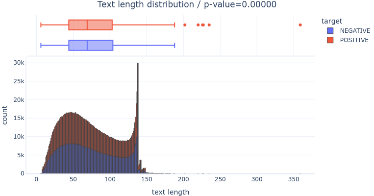
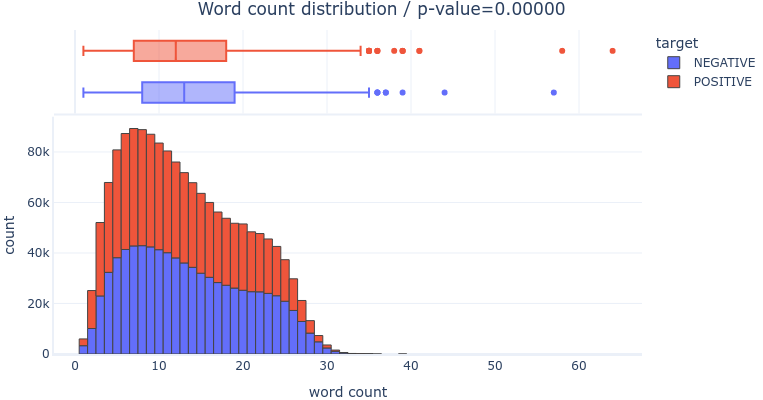
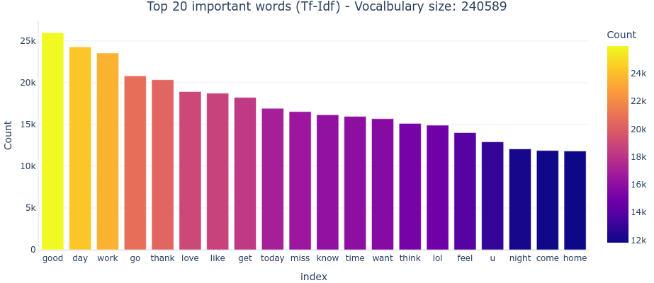
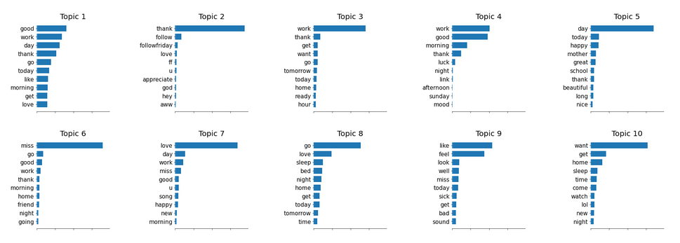

# Comparing Azure Tools for Sentiment Analysis

_Sentiment Analysis_ is one of the most classic [NLP] problems :

> Given a sentence, would you say its rather _POSITIVE_ or _NEGATIVE_ ?

This questions seems so simple at first ! It seems almost natural to our human mind to classify simple sentences :

> "I love my friends because they make me happy everyday!" 👍

> "My dog died today, I'm so sad..." 👎

But not all sentences are so "simple".

> "She had some amazing news to share but nobody to share it with." 🤔

There are multiple challenges that can make this task much more difficult :

- **language** : the given sentence could be in any language, potentially one you don't understand
- **language quality** : even if you know the language, the sentence could be written in a very un-intelligible way (with spelling, conjugation, grammar, syntax errors, ...)
- **language technique** : even in a perfectly well written English, the author could use a rhetorical device to imply a different meaning than the literal sense of the words (humor, derision, irony, sarcasm, ...)
- **context** : taking a sentence out of its context can completely change its meaning
- **subjectivity** : different people will interpret the same sentence differently depending on their personal way of thinking

Now, imagine you are the head of [PR] for a famous company. You want to prevent all the "bad buzz" that could affect the image of your company.
To do this, you need to monitor what people say on the Internet and be able to detect _NEGATIVE_ messages concerning your company in order to act before the word spreads.

In this post, we are going to cover different **Azure** services that we can use to predict the sentiment of **tweets**.

All the code is available on [GitHub].

---

- [Comparing Azure Tools for Sentiment Analysis](#comparing-azure-tools-for-sentiment-analysis)
  - [Exploratory Data Analysis](#exploratory-data-analysis)
    - [Target variable](#target-variable)
    - [Text variable](#text-variable)
      - [Length](#length)

---

## Exploratory Data Analysis

Complete code available in [notebook.ipynb](https://fleuryc.github.io/OC_AI-Engineer_P7_Detect-bad-buzz-with-deep-learning/notebook.html)

The data we are going to use is [Kaggle - Sentiment140] dataset :

- 1.6 million tweets : low language quality : many Twitter specific words ("RT", @username, #hashtags, urls, slang, ... )
- target : binary categorical variable representing the sentiment of the tweet
  - `0` = negative
  - `4` = positive

### Target variable

The target variable is perfectly balanced.

### Text variable

#### Length

There are no big difference between the _POSITIVE_ and _NEGATIVE_ tweets, but _NEGATIVE_ tweets are slightly longer than POSITIVE tweets.

In both classes, there are two modes : ~45 characters and 138 characters (the maximum allowed at some point).

There are no big difference between the _POSITIVE_ and _NEGATIVE_ tweets, but _NEGATIVE_ tweets are significatively longer than _POSITIVE_ tweets. In both classes, there are two modes : ~7 words and ~20 words.

#### Words importance

After cleanig the text (lowercase, stopwords, [SpaCy lemmatization]), we can see the most common words ([Tf-Idf] weighted) in the dataset :

#### Topic modeling

Running a [LSA] on the cleaned text, we can identify **topics** :

Running a simple [Logistic Regression] on the dataset, we can measure the **importance** of each topic towards the target variable :

We can see that the most important topics are :

- _NEGATIVE_ topics :
  - topic #3 : "work"
  - topic #6 : "miss"
  - topic #10 : "want", "get", "home", "sleep"
- _POSITIVE_ topics :
  - topic #2 : "thank"
  - topic #7 : "love"
  - topic #4 : "work", "good", "morning", "thank"
  - topic #8 : "go", "love", "sleep", "bed"

## AI as a Service (AIaaS) : [Azure Cognitive Services - Text Analytics]

## AzureML Studio's [Automated ML]

## AzureML Studio's [Designer]

## AzureML Studio's [Notebooks]

---

[nlp]: https://en.wikipedia.org/wiki/Natural_language_processing "Natural Language Processing"
[pr]: https://en.wikipedia.org/wiki/Public_relations "Public Relations"
[kaggle - sentiment140]: https://www.kaggle.com/kazanova/sentiment140 "dataset with 1.6 million tweets nad their sentiment"
[azure cognitive services - text analytics]: https://docs.microsoft.com/en-us/azure/cognitive-services/text-analytics/overview "Azure Sentiment Analysis API"
[automated ml]: https://docs.microsoft.com/en-us/azure/machine-learning/concept-automated-ml "Azure Studio Automated ML"
[designer]: https://docs.microsoft.com/en-us/azure/machine-learning/concept-designer "Azure Studio Designer"
[notebooks]: https://docs.microsoft.com/en-us/azure/machine-learning/how-to-run-jupyter-notebooks "Azure Studio Notebooks"
[github]: https://github.com/fleuryc/OC_AI-Engineer_P7_Detect-bad-buzz-with-deep-learning "Air Paradis : Detect bad buzz with deep learning"
[spacy lemmatization]: https://spacy.io/usage/linguistic-features#lemmatization "SpaCy lemmatization"
[tf-idf]: https://en.wikipedia.org/wiki/Tf%E2%80%93idf "Term frequency - Inverse document frequency"
[lsa]: https://en.wikipedia.org/wiki/Latent_semantic_analysis "Latent semantic analysis"
[logistic regression]: https://en.wikipedia.org/wiki/Logistic_regression "Logistic regression"
